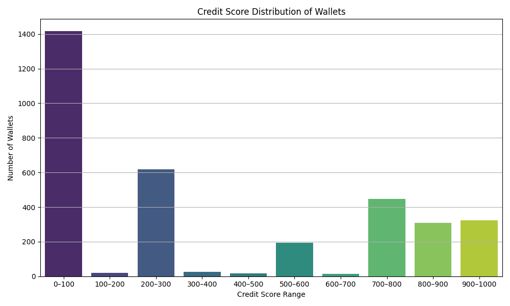

Wallet Credit Score Analysis

This report analyzes the score distribution of wallets that interacted with Aave V2 based on their transaction behavior.

#Score Distribution

| Score Range | Number of Wallets |
|-------------|-------------------|
| 0–100 | 1416 |
| 100–200 | 21 |
| 200–300 | 619 |
| 300–400 | 26 |
| 400–500 | 17 |
| 500–600 | 195 |
| 600–700 | 13 |
| 700–800 | 447 |
| 800–900 | 310 |
| 900–1000 | 323 |

*Distribution graph below:*

Behavior of Low-Scoring Wallets (0–300)

- Frequent borrowing without repaying
- Low diversity in actions
- Higher rate of liquidation calls
- Typically low transaction volume (under $100)

 Behavior of High-Scoring Wallets (700–1000)

- Consistent deposits and repayments
- High total transaction value (often over $1000)
- Low or zero liquidation calls
- Human-like usage patterns over time
Conclusion

The scoring method provides a useful lens to distinguish between risky and responsible DeFi users. This can be extended to monitor wallet risk over time or used in risk-aware access control for protocols.
